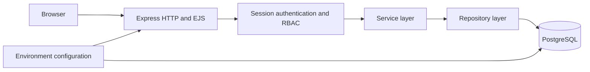

# E-Commerce Platform

[](https://github.com/a25618665/E-Commerce-Platform/actions/workflows/ci.yml)

A server-rendered e-commerce application built with Node.js, Express, EJS, and PostgreSQL. The project originated as a three-person university database project and was reorganized into a reproducible, security-focused software-engineering portfolio repository.

## Engineering highlights

- **Layered backend:** separates HTTP routing, authentication, services, repositories, database access, configuration, and process lifecycle while preserving 20 unique method-and-path contracts.
- **Efficient catalog reads:** replaces the original `2N+1` product/image/seller lookup pattern with one parameterized join; a 100-product catalog therefore requires 1 query instead of 201.
- **Authentication and authorization:** stores new passwords with salted `scrypt` hashes, upgrades compatible legacy plaintext records after successful login, signs HTTP-only session cookies, and enforces administrator, member, and seller permissions at route boundaries.
- **Relational persistence:** defines versioned PostgreSQL migrations for 4 connected tables with primary keys, foreign keys, uniqueness rules, check constraints, and catalog indexes.
- **Automated verification:** runs 40 dependency-light Node.js tests plus a Docker Compose smoke test that initializes PostgreSQL and requests the rendered storefront.

## Architecture



The repository layer owns SQL and parameter binding. The service layer owns validation, authentication decisions, and view-model mapping. The HTTP layer preserves the original storefront, administrator, member, and seller routes without embedding database logic in request handlers.

## Verified scale

| Evidence | Verified count |
| --- | ---: |
| Unique HTTP method/path combinations | 20 |
| Product-discovery workflows | 4 |
| Active relational entities | 4 |
| Supported application roles | 3 |
| Automated tests | 40 |
| Deterministic demo products | 6 |

The four product-discovery workflows are catalog browsing, keyword search, category filtering, and product-detail viewing. Product presentation joins `product`, `product_image`, and `member` data to render names, prices, descriptions, seller names, and distributable placeholder images.

## Technology

| Area | Tools |
| --- | --- |
| Backend | JavaScript, Node.js 22, Express, EJS |
| Database | PostgreSQL 16, `pg`, versioned SQL migrations |
| Security | `scrypt`, signed HTTP-only cookies, RBAC, parameterized SQL |
| Infrastructure | Docker, Docker Compose, health checks |
| Quality | Node.js test runner, GitHub Actions, Dependabot |

## Run with Docker

Prerequisites: Docker Desktop or another environment with Docker Compose v2.

```bash
git clone https://github.com/a25618665/E-Commerce-Platform.git
cd E-Commerce-Platform
docker compose up --build
```

PostgreSQL must pass its readiness check before the application starts. Open `http://localhost:3000` after both services become healthy.

The first startup applies the schema and creates 3 demo accounts, 6 products, 6 placeholder image mappings, and 1 coupon. All demo accounts use `PortfolioDemo123!`:

| Role | Username |
| --- | --- |
| Administrator | `demo_admin` |
| Seller | `demo_seller` |
| Member | `demo_member` |

These public credentials are only for a local demonstration. Override the database values and `SESSION_SECRET` before using the application in a shared environment.

Stop the services while retaining database state:

```bash
docker compose down
```

Remove the named database volume and recreate the deterministic environment:

```bash
docker compose down --volumes
docker compose up --build
```

## Run the tests

The unit and regression suites do not require a running database:

```bash
npm ci
npm test
```

Continuous integration performs two stages on every pull request and `main` update:

1. Installs the locked dependency set, checks JavaScript syntax, and runs all 40 tests.
2. Builds the application and PostgreSQL containers, waits for both health checks, and verifies the storefront returns a successful response.

## Repository structure

```text
.
|-- .github/                 # CI and dependency-update automation
|-- database/
|   |-- migrations/         # Versioned PostgreSQL schema
|   `-- seed/               # Deterministic local demonstration data
|-- public/                  # Styles and distributable image placeholders
|-- src/
|   |-- repositories/       # Parameterized PostgreSQL operations
|   |-- security/           # Password hashing, sessions, and RBAC
|   |-- services/           # Validation and application behavior
|   |-- app.js              # Express routes and error boundary
|   |-- config.js           # Environment-driven configuration
|   |-- database.js         # PostgreSQL pool construction
|   `-- server.js           # Startup and graceful shutdown
|-- test/                    # Automated unit and regression tests
|-- views/                   # Existing EJS interfaces
|-- compose.yaml
`-- Dockerfile
```

## Security baseline

- Production startup fails without an explicit `SESSION_SECRET`.
- New passwords are salted and hashed; malformed hashes fail closed.
- Signed session cookies are HTTP-only and use `SameSite=Lax`.
- Role-specific routes return explicit `401` and `403` responses.
- Registration and coupon inputs are validated before persistence.
- Repository writes and filters use PostgreSQL placeholders.
- Credentials, dependencies, superseded prototypes, and unverified product photographs are excluded from Git.

This remains a portfolio application rather than a production commerce service. Payment processing and complete cart/order persistence are outside its current scope.
